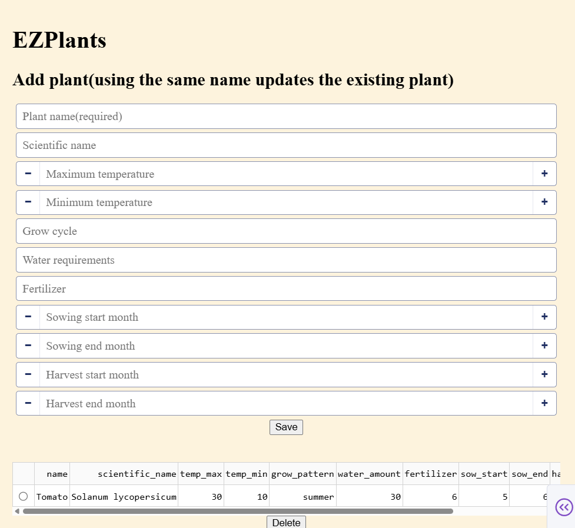

# EZPlants

A plant database application built with Python.

It allows you to manage plant information and visualize growing conditions with charts.

## Features

- Add, update, and delete plant data
- Search plants by name
- Display comfortable temperature ranges
- Display growing schedules with a Gantt chart
- Display watering logs from [Waterflow](https://github.com/nycodesea/ez-life-waterflow)
- SQLite database

## Screenshots


## Installation

```
git clone https://github.com/nycodesea/EZPlants.git
cd EZPlants
uv sync
```

## Usage

```
uv run python app.py
```

Open the displayed URL in your browser.

You can:

- Add, update, and delete plant data
- Search for plants
- View temperature charts
- View growing schedules using a Gantt chart

## Future Plans

- Integrate with other EZ applications
- Use EZPlants as a central plant database
- ~~Connect with [EZ WaterFlow](https://github.com/nycodesea/ez-life-waterflow) for automatic watering~~

## License

MIT License
